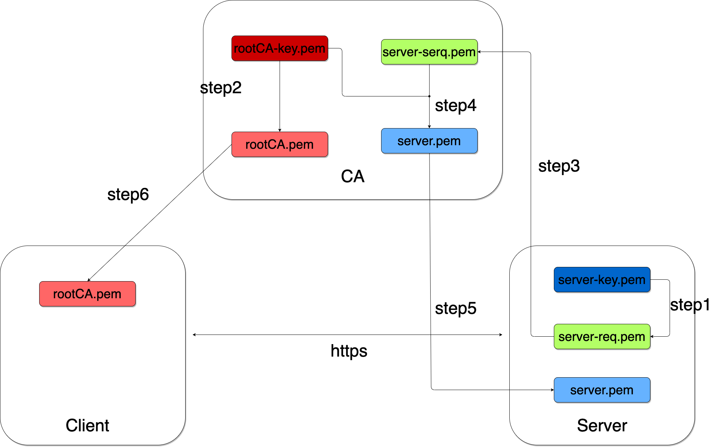

# docker-https-with-self-CA

## 🗄 About docker-https-with-self-CA

docker-https-with-self-CA enables https communication between client and server.

- Using Docker compose
- Using self certification authority(CA) with [mkcert](https://github.com/FiloSottile/mkcert)



- Certificate Authority(CA)
  - `rootCA-key.pem`: private key of CA
  - `rootCA.pem`: root certificate of CA
- Server
  - `server-key.pem`: private key of Server
  - `server-req.pem`: certificate signing request(CSR) of Server
  - `server.pem`: certificate valid for Server

For https communication between Client and Server, a server certificate is required on the Server side and a root certificate of the CA is required on the Client side.

## 👟 Getting started

### Step1. Create secret key and CSR at Server

- Create private key(`server-key.pem`) and CSR(`server-req.pem`) of Server on Local. These files are mounted with the server container after the server is launched with docker compose.

    ``` shell
    cd server/cert
    openssl req -nodes -newkey rsa:4096 -keyout server-key.pem -out server-req.pem -subj "/C=JP/ST=Osaka/CN=server"
    ```

    Note: Common Name(CN) must be match container name of server.

### Step2. Create self CA using mkcert

- Run Server

    ``` shell
    make up-CA
    ```

- In `myca`, create self CA using `mkcert -install` command.

    ``` shell
    docker compose exec myca /bin/bash

    root@myca:/# cd ~
    root@myca:~# pwd
    /root
    root@myca:~# mkcert -install
    Created a new local CA 💥
    The local CA is now installed in the system trust store! ⚡️
    ```

- Then, CA private key(`rootCA-key.pem`) and root CA certificate(`rootCA.pem`) are generated.

    ``` shell
    root@myca:~# ls .local/share/mkcert/
    rootCA-key.pem	rootCA.pem
    ```

### Step3. Upload CSR to CA

- Copy the CSR(`server-req.pem`) to the `mkcert` directory mounted inside the CA container(`myca`). In this way, the CSR file can be uploaded inside `myca` in a pseudo-style.

    ``` shell
    cp server/cert/server-req.pem mkcert/
    ```

### Step4. Create a new certificate from CSR valid for Server

- `server.pem` file is server certificate.

    ``` shell
    root@myca:~# mkcert -csr server-req.pem

    Created a new certificate valid for the following names 📜
    - "server"

    The certificate is at "./server.pem" ✅

    It will expire on 16 August 2025 🗓
    ```

### Step5. Send the certificate to server

- Copy the server certificate(`server.pem`) to the `server/cert` directory mounted inside the server container(`server`). In this way, the certificate file can be send to `server` by CA(`myca`) in a pseudo-style.

    ``` shell
    cp mkcert/server.pem server/cert
    ```

- Run Server

    ``` shell
    make up-server
    ```

### Step6. Add rootCA certificate to Client

- Run Client

    ``` shell
    make up-client
    ```

- Copy the root CA certificate(`rootCA.pem`) to the `client/cert/` directory mounted inside the Client container(`client`). In this way, the certificate can be send to `client` by CA(`myca`) in a pseudo-style.

    ``` shell
    cp mkcert/.local/share/mkcert/rootCA.pem client/cert/
    ```

- In the Client container, place the root certificate in the appropriate directory

    ``` shell
    docker compose exec client sh -c "cp client/cert/rootCA.pem  /etc/ssl/certs/"
    ```


Throw https request from client to server

``` shell
curl localhost:8081
{"message":"Hello, World!, Current Time:2023/05/22 16:54:25"}
```

🐶 I hope this repository helps you studying self signed CA.
